<div align="center">

> Hello world! This is the project’s summary that describes the project plain and simple, limited to the space available.

 **[PROJECT PHILOSOPHY](#project-philosophy) • [WIREFRAMES](#wireframes) • [TECH STACK](#tech-stack) • [IMPLEMENTATION](#implementation) • [HOW TO RUN?](#how-to-run)**


</div>

<br><br>


> Kaffi , the Arabic for "Keep Going", is an independent nonprofit organization founded to ease the burden on the shoulders of the students and allow them to carry on their education. We at Kaffi, know very well the situation of the Lebanese students abroad as most of us have been through this before. We also know that the current economic crisis affecting Lebanon is jeopardizing these students' chance of continuing their education. This has driven us to take immediate action and do our best to help! 
> 
> Kaffi-lb is a website implemented to enable Lebanese students studying abroad to submit scholarship applications, donators to donate money to support the NGO, activists to submit volunteering applications, and to connect students with mentors across the world through a chat system.
> **At Kaffi, we believe that education is the best form of investment for the future of an individual, a family and a community.**

### User Stories
- As a student, I want to be able to apply for scholarships and connect with mentors easily.
- As a mentor, I want to connect with students through a private chatting system.
- As a donator, I want to be able to donate money online for the NGO.
- As an activist, I want to volunteer with the NGO by submitting an online form.


<br><br>

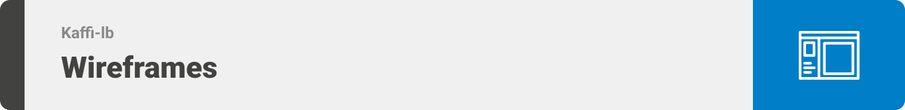


> This design was planned before on paper, then moved to Figma app for the fine details.
Note that no styling library or theme was used in the project, all from scratch and using pure css modules, except for two components.


<table>
   <tr>
    <td>Landing</td>
    <td>Signup</td>
   </tr>
   <tr>
    <td>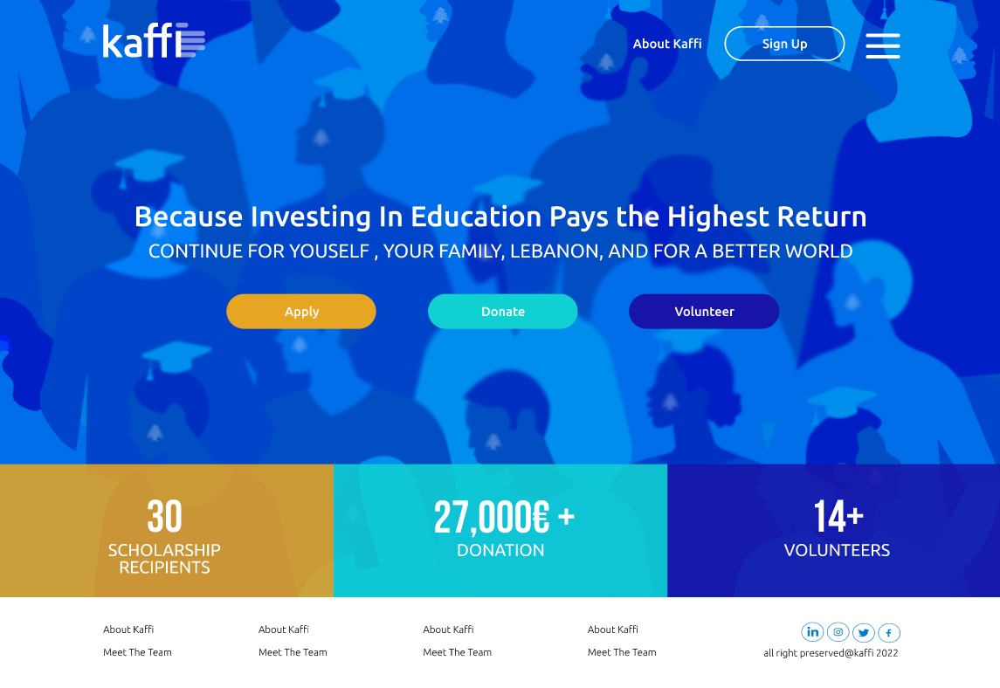</td>
    <td>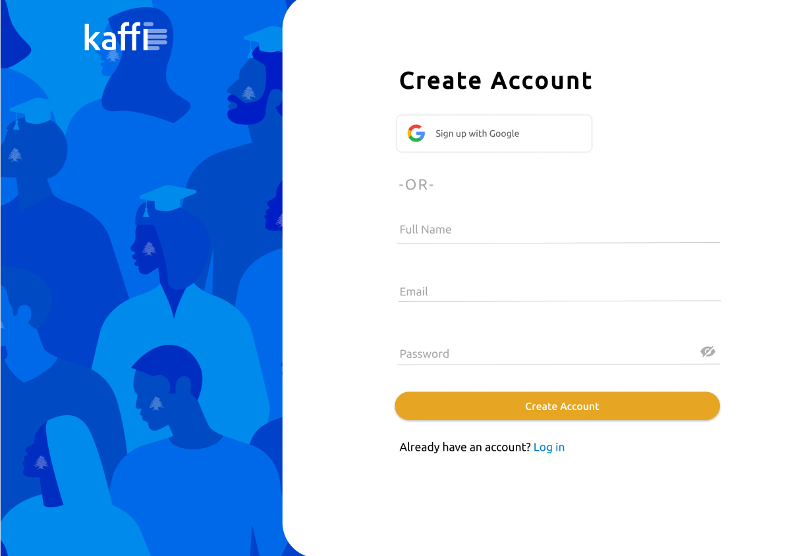</td>
   </tr>
   <tr>
    <td>Open Scholarship</td>
    <td>Closed Scholarship</td>
   </tr>
   <tr>
    <td>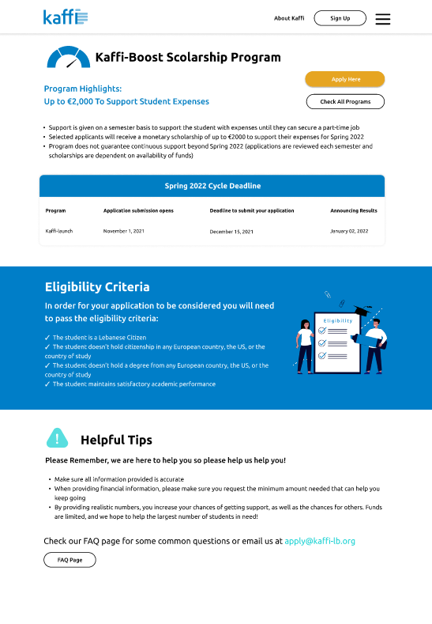</td>
    <td>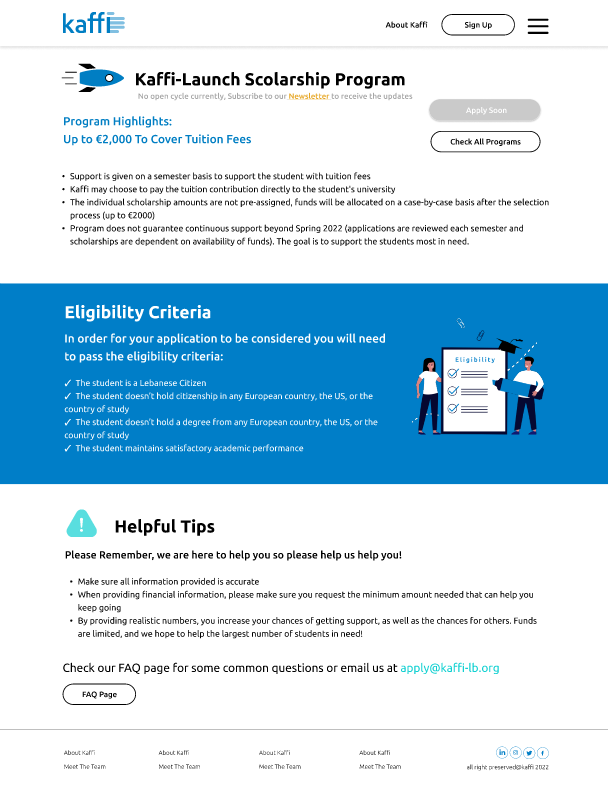</td>
   </tr>
   <tr>
    <td>Donate</td>
    <td>Records</td>
   </tr> 
   <tr>
    <td>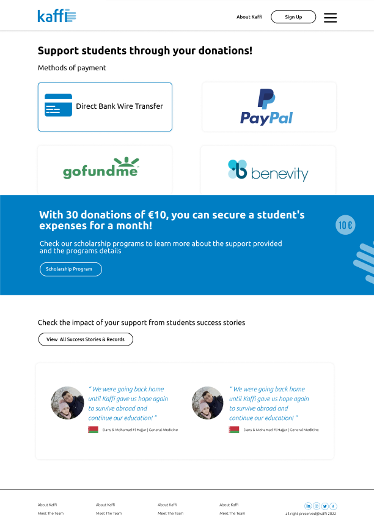</td>
    <td>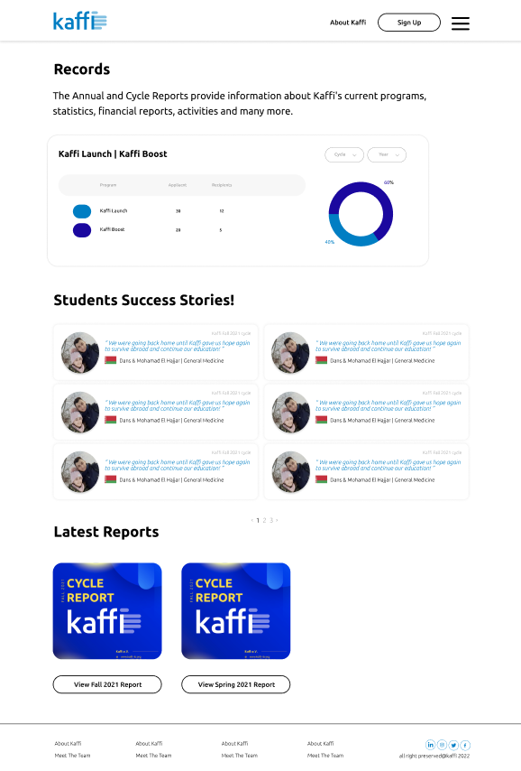</td>
   </tr>
    <tr>
    <td>Team</td>
    <td>Webinars</td>
   </tr> 
   <tr>
    <td>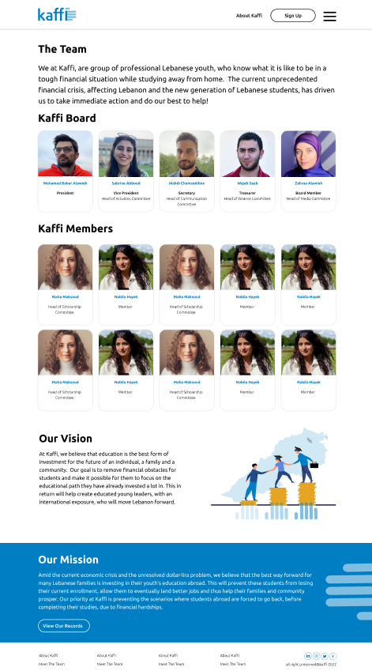</td>
    <td>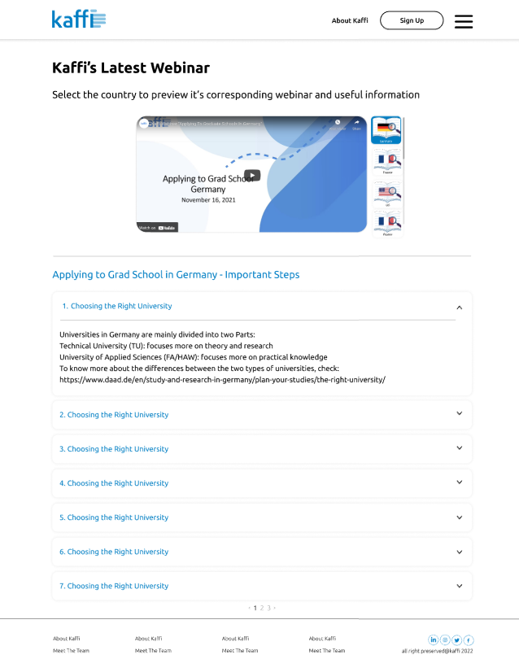</td>
   </tr>
</table>


<br><br>

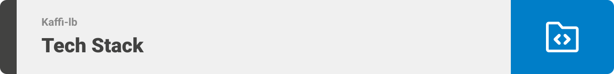


Here's a brief high-level overview of the tech stack the app uses:


**Front-end:** The project uses the [React JavaScript Library](https://reactjs.org/). 
-[React](https://reactjs.org/) (also known as [React.js](https://reactjs.org/) or [ReactJS](https://reactjs.org/)) is a free and open-source front-end JavaScript library for building user interfaces based on UI components. React can be used as a base in the development of single-page, mobile, or server-rendered applications with frameworks like [Next.js](https://nextjs.org/).

**Back-end:** The project uses the [Node.js] Platform(https://nodejs.org/en/) and [Express.js](https://expressjs.com/) Framework. 
-[Node.js](https://nodejs.org/en/) is an open-source, cross-platform, back-end JavaScript runtime environment that runs on the V8 engine and executes JavaScript code outside a web browser. 
-[Express.js](https://expressjs.com/) is a minimal and flexible Node.js web application framework that provides a robust set of features for web and mobile applications.

**Database:** The project uses [MySQL](https://www.mysql.com/), [phpMyAdmin](https://www.phpmyadmin.net/) and [Cloud Firestore](https://firebase.google.com/docs/firestore).
- [MySQL](https://www.mysql.com/) is a relational database management system that uses SQL. SQL is primarily used to query and operate database systems. [MySQL](https://www.mysql.com/) allows you to handle, store, modify and delete data and store data in an organized way.
- [phpMyAdmin](https://www.phpmyadmin.net/) is a free and open source administration tool for [MySQL](https://www.mysql.com/) and [MariaDB](https://mariadb.org/). As a portable web application written primarily in [PHP](https://www.php.net/), it has become one of the most popular [MySQL](https://www.mysql.com/) administration tools, especially for web hosting services.
- [Cloud Firestore](https://firebase.google.com/docs/firestore) is a flexible, scalable database for mobile, web, and server development from [Firebase](https://firebase.google.com/) and [Google Cloud](https://cloud.google.com/). It keeps your data in sync across client apps through realtime listeners and offers offline support for mobile and web so you can build responsive apps that work regardless of network latency or Internet connectivity.
- For storing user images, this project uses [Cloudinary](https://cloudinary.com/). [Cloudinary](https://cloudinary.com/) is an end-to-end image- and video-management solution for websites and mobile apps, covering everything from image and video uploads, storage, manipulations, optimizations to delivery.
- The app uses the font ["Ubuntu"](https://fonts.google.com/specimen/Ubuntu) as its main font, and the design of the app adheres to the material design guidelines.


<br><br>

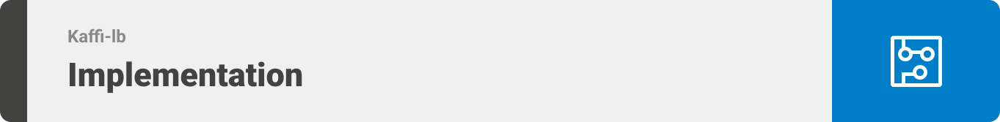


> Uing the above mentioned tech stacks and the wireframes build with figma from the user stories we have, the implementation of the app is shown as below, these are screenshots and recordings from the real app.


<table>
   <tr>
    <td>Landing</td>
    <td>Signup</td>
   </tr>
   <tr>
    <td>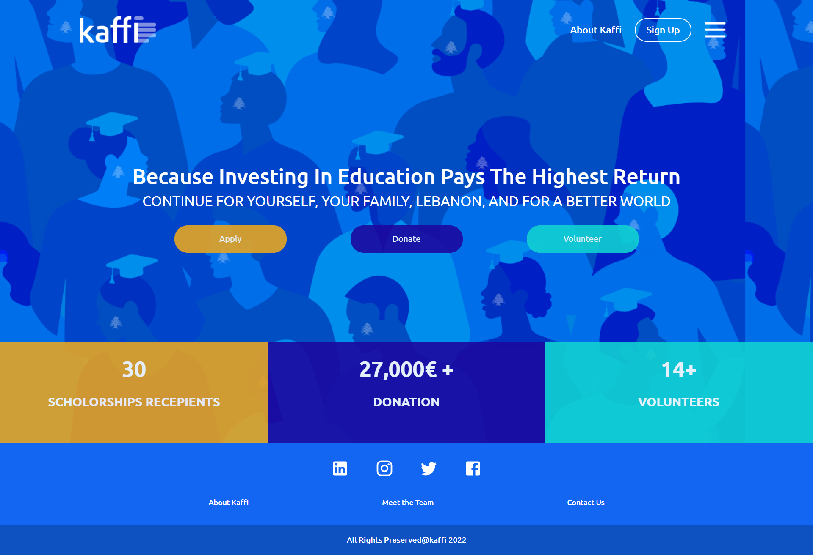</td>
    <td>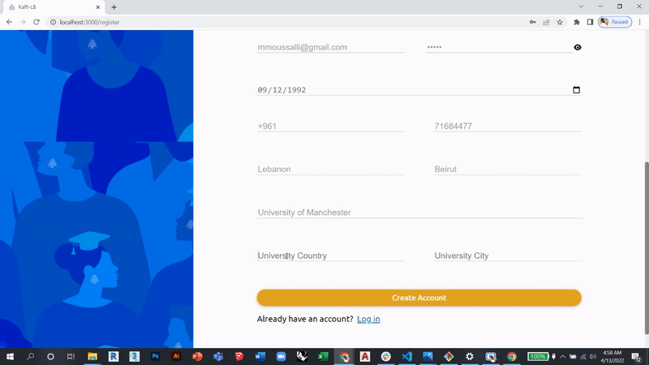</td>
   </tr>
   <tr>
    <td>Open Scholarship</td>
    <td>Closed Scholarship</td>
   </tr>
   <tr>
    <td>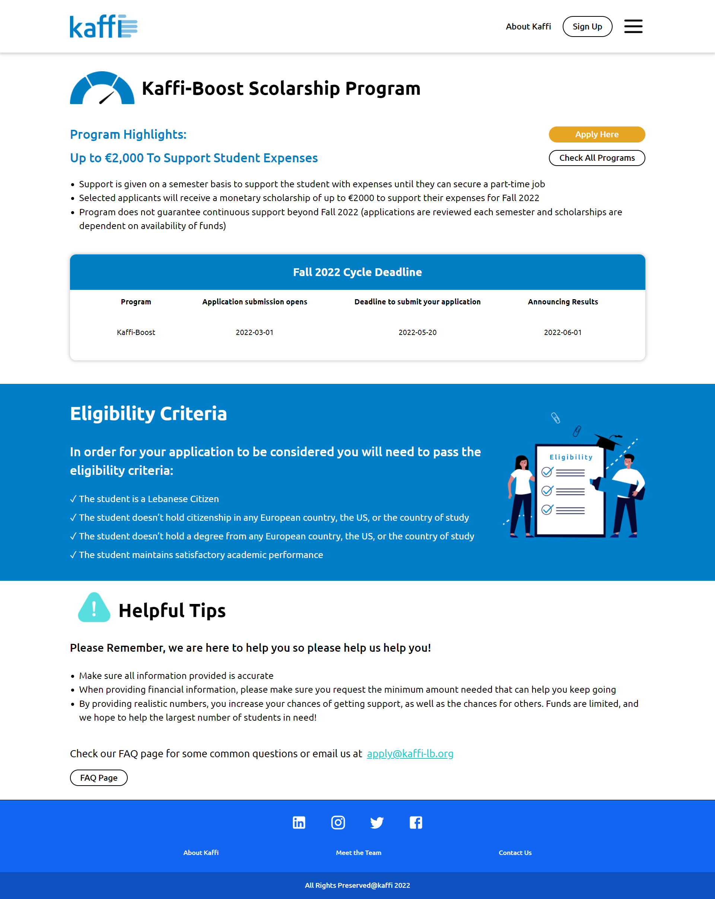</td>
    <td>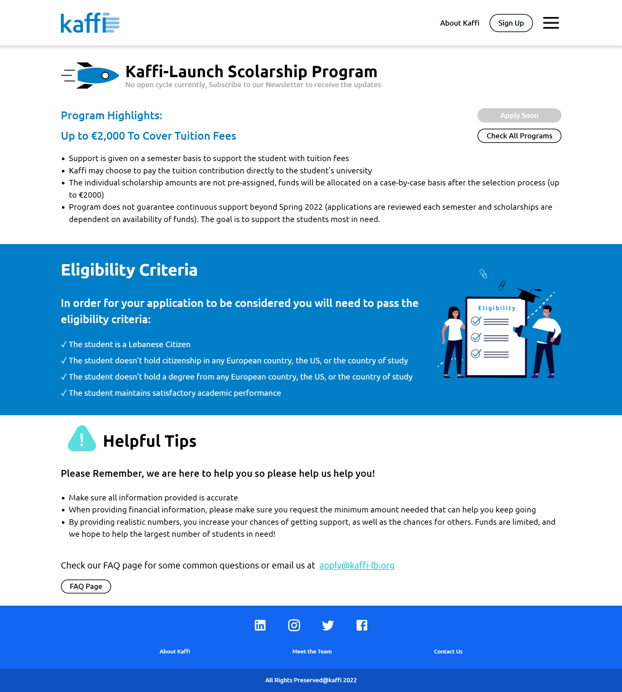</td>
   </tr>
   <tr>
    <td>Donate</td>
    <td>Records</td>
   </tr> 
   <tr>
    <td>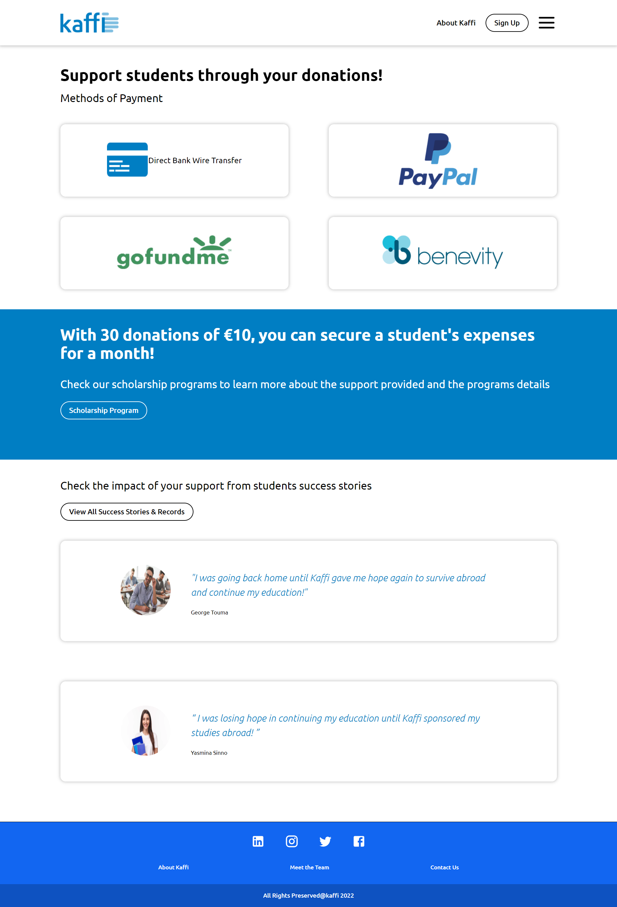</td>
    <td>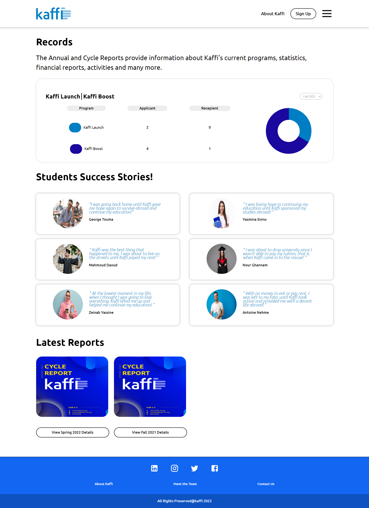</td>
   </tr>
   <tr>
    <td>Dashboard</td>
    <td>Chat</td>
   </tr> 
   <tr>
    <td>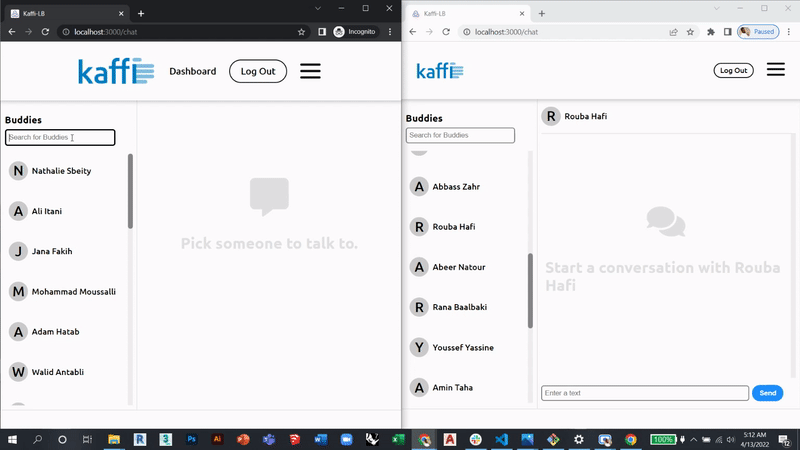</td>
    <td>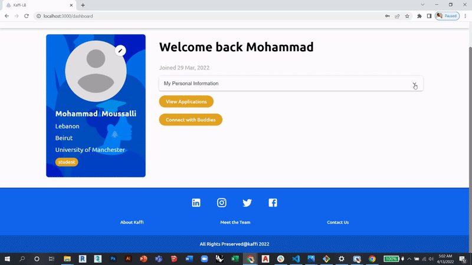</td>
   </tr>
</table>


<br><br>

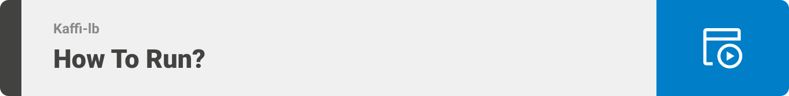


> To get a local copy up and running follow these simple steps.


### Prerequisites

* Download and install [Node.js](https://nodejs.org/en/)

* npm
  ```sh
  npm install npm@latest -g
  ```

### Installation

1. Clone the repo
   ```sh
   git clone https://github.com/mohammad-moussalli/se-factory-final-project
   ```
2. Navigate to the back-end folder and install dependencies
   ```sh
   cd back-end/nodejs
   npm install
   ```
3. To run the Express server use this command in the nodejs directory
   ```sh
   npm start
   ```
4. Open a new terminal and navigate to the front-end folder and install dependencies
   ```sh
   cd front-end/reactjs
   npm install
   ```
5. To run the React server use this command in the reactjs directory
   ```sh
   npm start
   ```
6. For the project to function properly you should update your .env file accordingly
   ```sh
   cd back-end/nodejs/.env
   cd front-end/reactjs/.env
   ```
