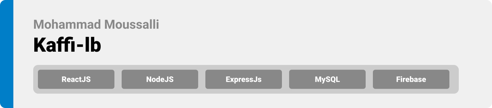

<div align="center">

> Hello world! This is the project’s summary that describes the project plain and simple, limited to the space available.

 **[PROJECT PHILOSOPHY](#project-philosophy) • [WIREFRAMES](#wireframes) • [TECH STACK](#tech-stack) • [IMPLEMENTATION](#implementation) • [HOW TO RUN?](#how-to-run)**


</div>

<br><br>


> Kaffi , the Arabic for "Keep Going", is an independent nonprofit organization founded to ease the burden on the shoulders of the students and allow them to carry on their education. We at Kaffi, know very well the situation of the Lebanese students abroad as most of us have been through this before. We also know that the current economic crisis affecting Lebanon is jeopardizing these students' chance of continuing their education. This has driven us to take immediate action and do our best to help! 
> 
> Kaffi-lb is a website implemented to enable Lebanese students studying abroad to submit scholarship applications, donators to donate money to support the NGO, activists to submit volunteering applications, and connect students with mentors across the world through a chat system.
#### At Kaffi, we believe that education is the best form of investment for the future of an individual, a family and a community.

### User Stories
- As a student, I want to be able to apply for scholarships and connect with mentors easily.
- As a mentor, I want to connect with students through a private chatting system.
- As a donator, I want to be able to donate money online for the NGO.
- As an activist, I want to volunteer with the NGO by submitting an online form.

<br><br>


> This design was planned before on paper, then moved to Figma app for the fine details.
Note that no styling library or theme was used in the project, all from scratch and using pure css modules, except for one component.
| Landing  | Signup  |
| -----------------| -----|
|  | ![Signup]
(https://github.com/mohammad-moussalli/se-factory-final-project/blob/main/readme/register.png) |

| Open Scholarship  | Closed Scholarship  |
| -----------------| -----|
|  |  |

| Donate  | Records  |
| -----------------| -----|
|  | ![Records]
(https://github.com/mohammad-moussalli/se-factory-final-project/blob/main/readme/records.png) |

| Team  | Webinars  |
| -----------------| -----|
|  | ![Webinars]
(https://github.com/mohammad-moussalli/se-factory-final-project/blob/main/readme/webinars.png) |


<br><br>


Here's a brief high-level overview of the tech stack the Well app uses:

- This project uses the [Flutter app development framework](https://flutter.dev/). Flutter is a cross-platform hybrid app development platform which allows us to use a single codebase for apps on mobile, desktop, and the web.
- For persistent storage (database), the app uses the [Hive](https://hivedb.dev/) package which allows the app to create a custom storage schema and save it to a local database.
- To send local push notifications, the app uses the [flutter_local_notifications](https://pub.dev/packages/flutter_local_notifications) package which supports Android, iOS, and macOS.
  - 🚨 Currently, notifications aren't working on macOS. This is a known issue that we are working to resolve!
- The app uses the font ["Work Sans"](https://fonts.google.com/specimen/Work+Sans) as its main font, and the design of the app adheres to the material design guidelines.


<br><br>


> Uing the above mentioned tecch stacks and the wireframes build with figma from the user sotries we have, the implementation of the app is shown as below, these are screenshots from the real app
| Landing  | Home/Search  |
| -----------------| -----|
|  |  |


<br><br>


> This is an example of how you may give instructions on setting up your project locally.
To get a local copy up and running follow these simple example steps.
### Prerequisites

This is an example of how to list things you need to use the software and how to install them.
* npm
  ```sh
  npm install npm@latest -g
  ```

### Installation

_Below is an example of how you can instruct your audience on installing and setting up your app. This template doesn't rely on any external dependencies or services._

1. Get a free API Key at [https://example.com](https://example.com)
2. Clone the repo
   ```sh
   git clone https://github.com/your_username_/Project-Name.git
   ```
3. Install NPM packages
   ```sh
   npm install
   ```
4. Enter your API in `config.js`
   ```js
   const API_KEY = 'ENTER YOUR API';
   ```
